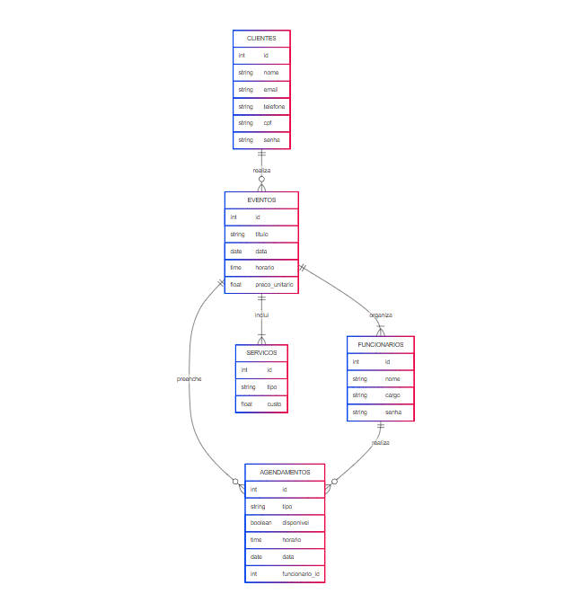

# Web Application Document - Projeto Individual - Módulo 2 - Inteli

**_Os trechos em itálico servem apenas como guia para o preenchimento da seção. Por esse motivo, não devem fazer parte da documentação final._**

## Fresh Muse

#### Autor: Isabela Szolnoky Ferreira Cabral Souza da Conceição

## Sumário

1. [Introdução](#c1)  
2. [Visão Geral da Aplicação Web](#c2)  
3. [Projeto Técnico da Aplicação Web](#c3)  
4. [Desenvolvimento da Aplicação Web](#c4)  
5. [Referências](#c5)  

<br>

## <a name="c1"></a>1. Introdução (Semana 01)

<div align="center">
   <sub>Imagem 1: Logo da marca.</sub><br>
   <br>
   <sup>Fonte: Fresh Muse, 2025 (Autoral)</sup>
 </div>

A Fresh Muse é uma empresa do setor de eventos que busca estruturar e otimizar seus processos internos e externos, oferecendo soluções mais sólidas e dinâmicas tanto para seus colaboradores quanto para seus clientes. Com foco em tecnologia, criatividade e excelência, a empresa visa aprimorar a experiência de todos os envolvidos.

Neste documento, será apresentado um modelo estratégico para o desenvolvimento do site institucional da Fresh Muse, alinhado às suas demandas operacionais, de comunicação e de atendimento. Focando principalmente nas dores da operação da empresa.


---

## <a name="c2"></a>2. Visão Geral da Aplicação Web

### 2.1. Personas (Semana 01 - opcional)

*Posicione aqui sua(s) Persona(s) em forma de texto markdown com imagens, ou como imagem de template preenchido. Atualize esta seção ao longo do módulo se necessário.*

### 2.2. User Stories (Semana 01 - opcional)

*Posicione aqui a lista de User Stories levantadas para o projeto. Siga o template de User Stories e utilize a referência USXX para numeração (US01, US02, US03, ...). Indique todas as User Stories mapeadas, mesmo aquelas que não forem implementadas ao longo do projeto. Não se esqueça de explicar o INVEST de 1 User Storie prioritária.*

---

## <a name="c3"></a>3. Projeto da Aplicação Web

### 3.1. Modelagem do banco de dados  (Semana 3)

<div align="center">
   <sub>Imagem 1: Diagrama de modelo relacional.</sub><br>
   <br>
   <sup>Fonte: Fresh Muse, 2025 (Autoral)</sup>
 </div>
 

O modelo de dados para a empresa Fresh Muse de eventos é composto por várias tabelas que representam os elementos essenciais da operação e gestão do cliente e funcionários.

Os clientes são as pessoas que contratam os serviços da empresa. Cada cliente possui dados pessoais como nome, email, telefone, CPF e senha. Um cliente pode contratar vários eventos, mas cada evento está vinculado a um único cliente, sendo caracterizado como uma relação “1:n”.

Os eventos contêm informações como título, data, horário e preço. Um evento pode contar com diversos serviços, como buffet, iluminação e som, e esses serviços são registrados em uma tabela separada de acordo com o diagrama acima. O relacionamento entre eventos e serviços é de “n:n”, ou seja, um evento pode incluir vários serviços e um mesmo serviço pode ser usado em diferentes eventos.

Além disso, os eventos são organizados por funcionários, profissionais da empresa com diferentes cargos, como técnicos ou coordenadores. O relacionamento entre eventos e funcionários também é de “n:n”, sendo que vários funcionários podem atuar em um evento, e um mesmo funcionário pode estar presente em vários eventos.

A empresa também controla a disponibilidade e o agendamento dos funcionários por meio da tabela de agendamentos, que registra a data, o horário, o tipo de atividade e se o horário está disponível, evitando desacordos entre os clientes e contribuindo para uma gestão estratégica. Cada agendamento está associado a um funcionário e pode estar vinculado a um evento. Assim, é possível saber quando um funcionário estará disponível para um trabalho específico ou quando ele está reservado para outro evento.

Facilitando, portanto, uma maior organização da Fresh Muse para melhor gestão operacional e atendimento ao cliente.


```sql
-- Tabela de CLIENTES
CREATE TABLE clientes (
    id SERIAL PRIMARY KEY,
    nome VARCHAR(100) NOT NULL,
    email VARCHAR(100) UNIQUE NOT NULL,
    telefone VARCHAR(20),
    cpf VARCHAR(14) UNIQUE NOT NULL,
    senha VARCHAR(255) NOT NULL
);

-- Tabela de FUNCIONARIOS
CREATE TABLE funcionarios (
    id SERIAL PRIMARY KEY,
    nome VARCHAR(100) NOT NULL,
    cargo VARCHAR(50),
    senha VARCHAR(255) NOT NULL
);

-- Tabela de SERVICOS
CREATE TABLE servicos (
    id SERIAL PRIMARY KEY,
    tipo VARCHAR(100),
    custo DECIMAL(10,2)
);

-- Tabela de EVENTOS
CREATE TABLE eventos (
    id SERIAL PRIMARY KEY,
    titulo VARCHAR(100) NOT NULL,
    data DATE NOT NULL,
    horario TIME NOT NULL,
    preco_unitario DECIMAL(10,2),
    cliente_id INT REFERENCES clientes(id) -- relacionamento: CLIENTES realiza EVENTOS
);

-- Tabela de AGENDAMENTOS
CREATE TABLE agendamentos (
    id SERIAL PRIMARY KEY,
    tipo VARCHAR(100),
    disponivel BOOLEAN DEFAULT TRUE,
    horario TIME NOT NULL,
    data DATE NOT NULL,
    funcionario_id INT REFERENCES funcionarios(id),
    evento_id INT REFERENCES eventos(id) -- relacionamento: EVENTOS preenche AGENDAMENTOS
);

-- Tabela de ligação: FUNCIONARIOS organizam EVENTOS (n:n)
CREATE TABLE evento_funcionario (
    evento_id INT REFERENCES eventos(id),
    funcionario_id INT REFERENCES funcionarios(id),
    PRIMARY KEY (evento_id, funcionario_id)
);

-- Tabela de ligação: EVENTOS incluem SERVICOS (n:n)
CREATE TABLE evento_servico (
    evento_id INT REFERENCES eventos(id),
    servico_id INT REFERENCES servicos(id),
    PRIMARY KEY (evento_id, servico_id)
);
```

### 3.1.1 BD e Models (Semana 5)
*Descreva aqui os Models implementados no sistema web*

### 3.2. Arquitetura (Semana 5)

*Posicione aqui o diagrama de arquitetura da sua solução de aplicação web. Atualize sempre que necessário.*

**Instruções para criação do diagrama de arquitetura**  
- **Model**: A camada que lida com a lógica de negócios e interage com o banco de dados.
- **View**: A camada responsável pela interface de usuário.
- **Controller**: A camada que recebe as requisições, processa as ações e atualiza o modelo e a visualização.
  
*Adicione as setas e explicações sobre como os dados fluem entre o Model, Controller e View.*

### 3.3. Wireframes (Semana 03 - opcional)

*Posicione aqui as imagens do wireframe construído para sua solução e, opcionalmente, o link para acesso (mantenha o link sempre público para visualização).*

### 3.4. Guia de estilos (Semana 05 - opcional)

*Descreva aqui orientações gerais para o leitor sobre como utilizar os componentes do guia de estilos de sua solução.*


### 3.5. Protótipo de alta fidelidade (Semana 05 - opcional)

*Posicione aqui algumas imagens demonstrativas de seu protótipo de alta fidelidade e o link para acesso ao protótipo completo (mantenha o link sempre público para visualização).*

### 3.6. WebAPI e endpoints (Semana 05)
| Entidade     | Método  | Rota                                              | Descrição                                  | Parâmetros / Corpo                                        |
|--------------|---------|--------------------------------------------------|--------------------------------------------|----------------------------------------------------------|
| **Agendamento** | GET     | `/`                                              | Listar todos os agendamentos               | —                                                        |
|              | GET     | `/disponiveis`                                   | Buscar agendamentos disponíveis            | —                                                        |
|              | GET     | `/data/:data`                                    | Buscar agendamentos por data                | `data` (ex: 2025-05-25)                                  |
|              | GET     | `/:id`                                           | Buscar agendamento por ID                   | `id`                                                    |
|              | GET     | `/funcionario/:funcionarioId`                    | Buscar agendamentos de um funcionário       | `funcionarioId`                                          |
|              | GET     | `/evento/:eventoId`                              | Buscar agendamentos de um evento            | `eventoId`                                              |
|              | POST    | `/`                                              | Criar um novo agendamento                   | Dados do agendamento no corpo                            |
|              | PUT     | `/:id`                                           | Atualizar um agendamento                    | `id` + dados atualizados no corpo                        |
|              | DELETE  | `/:id`                                           | Deletar um agendamento                      | `id`                                                    |
|              | PATCH   | `/:id/disponibilidade`                           | Alterar disponibilidade do agendamento     | `id` + novo status no corpo                              |
| **Cliente**  | POST    | `/`                                              | Criar um novo cliente                       | Dados do cliente no corpo                                |
|              | GET     | `/`                                              | Listar todos os clientes                    | —                                                        |
|              | GET     | `/:id`                                           | Buscar cliente por ID                       | `id`                                                    |
|              | PUT     | `/:id`                                           | Atualizar cliente                           | `id` + dados atualizados no corpo                        |
|              | DELETE  | `/:id`                                           | Deletar cliente                             | `id`                                                    |
|              | POST    | `/login`                                         | Login do cliente                            | Email e senha no corpo                                  |
| **Evento**   | GET     | `/`                                              | Listar todos os eventos                     | —                                                        |
|              | GET     | `/:id`                                           | Buscar evento por ID                        | `id`                                                    |
|              | GET     | `/cliente/:clienteId`                            | Buscar eventos de um cliente                | `clienteId`                                            |
|              | POST    | `/`                                              | Criar um novo evento                        | Dados do evento no corpo                                |
|              | PUT     | `/:id`                                           | Atualizar evento                            | `id` + dados no corpo                                    |
|              | DELETE  | `/:id`                                           | Deletar evento                             | `id`                                                    |
|              | POST    | `/:id/funcionarios`                             | Adicionar funcionário ao evento             | `id` (evento) + dados do funcionário                     |
|              | DELETE  | `/:eventoId/funcionarios/:funcionarioId`        | Remover funcionário do evento               | `eventoId`, `funcionarioId`                              |
|              | GET     | `/:id/funcionarios`                             | Listar funcionários de um evento            | `id` (evento)                                          |
|              | POST    | `/:id/servicos`                                 | Adicionar serviço ao evento                  | `id` (evento) + dados do serviço                         |
|              | DELETE  | `/:eventoId/servicos/:servicoId`                 | Remover serviço do evento                    | `eventoId`, `servicoId`                                  |
|              | GET     | `/:id/servicos`                                 | Listar serviços de um evento                 | `id` (eve


### 3.7 Interface e Navegação (Semana 07)

Foi desenvolvido o frontend da aplicação web Fresh Muse, com foco na construção de páginas funcionais e visualmente agradáveis, alinhadas à identidade da plataforma. A interface foi criada utilizando HTML, CSS e JavaScript, com atenção à responsividade e à experiência do usuário.

Foram entregues as seguintes telas principais:

Página inicial com botões de acesso para Clientes e Funcionários, apresentando uma navegação clara e estilo visual condizente com a proposta da marca.


Dashboard do cliente, onde é possível visualizar e criar eventos, com campos funcionais para preencher os dados necessários.

Visualização de eventos disponíveis para funcionários, com estrutura de calendário e botão para seleção de evento desejado.

Tela de perfil do funcionário, com dados básicos e acesso ao seu evento de trabalho atual.

A navegação entre as páginas foi feita com rotas simples em JavaScript, sem frameworks, priorizando leveza e controle direto sobre os componentes. A estrutura do frontend foi organizada para facilitar integrações com o backend.

## <a name="c4"></a>4. Desenvolvimento da Aplicação Web (Semana 8)

### 4.1 Demonstração do Sistema Web (Semana 8)

[Ver demonstração](https://drive.google.com/file/d/1NXIUpOujWuyi1eRfdeRQOC7mcXVRs7Bo/view?usp=sharing)

### 4.2 Conclusões e Trabalhos Futuros (Semana 8)

O projeto individual da aplicação web Fresh Muse teve como destaque o capricho visual: o site está visualmente adequado para a experiência do usuário, com uma identidade visual coerente e uma interface intuitiva, que transmite bem a proposta da plataforma. Também houve dedicação no desenvolvimento, com implementação funcional das principais rotas e uma estrutura básica em MVC, além da utilização de tecnologias adequadas como JavaScript e PostgreSQL.

Por outro lado, a modelagem do banco de dados ainda pode ser melhorada, especialmente no que diz respeito à clareza nas relações entre entidades e à normalização de algumas tabelas. Alguns fluxos mais complexos, como o agendamento de funcionários, poderiam ser mais bem estruturados. Ainda assim, o resultado entrega uma aplicação funcional e bem apresentada, com potencial para evoluir em termos técnicos à medida que for refinada como aplicação de login de cliente e funcionário.


## <a name="c5"></a>5. Referências